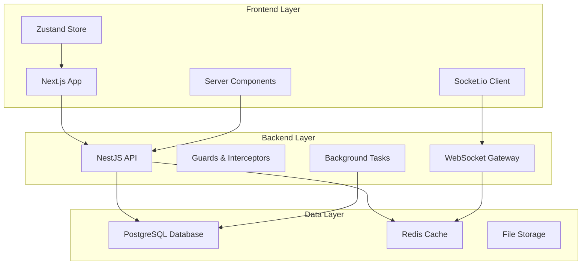

# 設計書

## 概要

ピア認識プラットフォームは、従業員がポイントベースのシステムを通じて互いを認識し報酬を与えることができるWebベースのアプリケーションです。このプラットフォームは、Next.jsフロントエンド、NestJSバックエンドAPI、PostgreSQLデータベースで構成され、リアルタイム通知、ユーザー管理、報酬交換ワークフローを処理するように設計されています。

## アーキテクチャ

システムは3層アーキテクチャに従います：



### 技術スタック
- **フロントエンド**: Next.js 14, TypeScript, Zustand, Tailwind CSS, shadcn/ui
- **バックエンド**: NestJS, TypeScript, Socket.io
- **データベース**: PostgreSQL with Prisma ORM
- **キャッシュ**: セッション管理とリアルタイム機能のためのRedis
- **認証**: JWT Guards with Passport.js
- **ファイルストレージ**: ユーザーアバター用のローカルファイルシステムまたはクラウドストレージ

## コンポーネントとインターフェース

### フロントエンドコンポーネント（Next.js）

#### ページコンポーネント
- **app/dashboard/page.tsx**: メインダッシュボードページ
- **app/recognition/page.tsx**: 感謝送信ページ
- **app/rewards/page.tsx**: 報酬ショップページ
- **app/profile/page.tsx**: ユーザープロフィールページ
- **app/analytics/page.tsx**: 分析ページ（マネージャー用）
- **app/admin/page.tsx**: 管理者ページ

#### コアコンポーネント
- **RecognitionForm**: ポイント配分付き感謝送信フォーム
- **RecognitionFeed**: 会社全体の感謝のタイムライン表示
- **UserProfile**: ポイント残高と履歴を表示するユーザーダッシュボード
- **RewardsShop**: ポイント交換のためのカタログインターフェース
- **SearchBar**: リアルタイムユーザー検索機能
- **NotificationCenter**: リアルタイム通知表示

#### レイアウトコンポーネント
- **app/layout.tsx**: ルートレイアウト
- **app/(auth)/layout.tsx**: 認証ページレイアウト
- **app/(dashboard)/layout.tsx**: ダッシュボードレイアウト

### バックエンドAPIエンドポイント（NestJS）

#### NestJSコントローラー構造
- **AuthController**: 認証関連のエンドポイント
- **RecognitionsController**: 感謝機能のエンドポイント
- **UsersController**: ユーザー管理のエンドポイント
- **RewardsController**: 報酬システムのエンドポイント
- **AdminController**: 管理者機能のエンドポイント

#### 認証ルート
```
POST /auth/login      # ログイン
POST /auth/logout     # ログアウト
POST /auth/refresh    # トークン更新
GET /auth/me          # 現在のユーザー情報取得
```

#### 感謝ルート
```
POST /recognitions                # 感謝送信
GET /recognitions/feed            # 会社全体の感謝フィード
GET /recognitions/user/:userId    # ユーザー別感謝履歴
PUT /recognitions/:id/privacy     # 感謝のプライバシー設定
```

#### ユーザールート
```
GET /users/search           # ユーザー検索
GET /users/:id/profile      # ユーザープロフィール取得
PUT /users/:id/profile      # ユーザープロフィール更新
GET /users/:id/analytics    # ユーザー分析データ
```

#### 報酬ルート
```
GET /rewards                # 報酬カタログ取得
POST /rewards/:id/redeem    # 報酬交換
GET /rewards/redemptions    # 交換履歴
```

#### 管理者ルート
```
GET /admin/analytics        # システム分析
PUT /admin/settings         # システム設定更新
POST /admin/rewards         # 報酬追加
PUT /admin/rewards/:id      # 報酬更新
DELETE /admin/rewards/:id   # 報酬削除
```

### WebSocketゲートウェイ（NestJS）
```typescript
@WebSocketGateway()
export class NotificationsGateway {
  // recognition:received - 新しい感謝通知
  // points:updated - ポイント残高変更
  // system:announcement - 管理者からのお知らせ
}
```

## データモデル

### User Model
```typescript
interface User {
  id: string
  email: string
  firstName: string
  lastName: string
  department: string
  role: 'employee' | 'manager' | 'admin'
  avatarUrl?: string
  pointsBalance: number
  monthlyPointsAllocation: number
  isActive: boolean
  createdAt: Date
  updatedAt: Date
}
```

### Recognition Model
```typescript
interface Recognition {
  id: string
  senderId: string
  recipientId: string
  message: string
  pointsAmount: number
  isPrivate: boolean
  createdAt: Date
  sender: User
  recipient: User
}
```

### Reward Model
```typescript
interface Reward {
  id: string
  title: string
  description: string
  pointsCost: number
  category: string
  imageUrl?: string
  isActive: boolean
  stockQuantity?: number
  createdAt: Date
  updatedAt: Date
}
```

### RewardRedemption Model
```typescript
interface RewardRedemption {
  id: string
  userId: string
  rewardId: string
  pointsSpent: number
  status: 'pending' | 'approved' | 'fulfilled' | 'cancelled'
  redemptionCode: string
  createdAt: Date
  user: User
  reward: Reward
}
```

### PointsTransaction Model
```typescript
interface PointsTransaction {
  id: string
  userId: string
  type: 'earned' | 'spent' | 'allocated'
  amount: number
  description: string
  relatedId?: string // Recognition or Redemption ID
  createdAt: Date
  user: User
}
```

## Error Handling

### Frontend Error Handling
- Global error boundary for React component errors
- Redux error states for API failures
- Toast notifications for user-facing errors
- Retry mechanisms for network failures
- Offline state detection and handling

### Backend Error Handling
- Centralized error middleware with structured logging
- Input validation using Joi or Zod schemas
- Database constraint error mapping
- Rate limiting for API endpoints
- Graceful degradation for external service failures

### Error Response Format
```typescript
interface ErrorResponse {
  error: {
    code: string
    message: string
    details?: any
    timestamp: string
  }
}
```

## Testing Strategy

### Frontend Testing
- **Unit Tests**: Jest + React Testing Library for components
- **Integration Tests**: API integration with MSW (Mock Service Worker)
- **E2E Tests**: Playwright for critical user journeys
- **Visual Tests**: Storybook for component documentation and testing

### Backend Testing
- **Unit Tests**: Jest for business logic and utilities
- **Integration Tests**: Supertest for API endpoint testing
- **Database Tests**: In-memory PostgreSQL for data layer testing
- **Load Tests**: Artillery.js for performance testing

### Test Coverage Goals
- Minimum 80% code coverage for critical paths
- 100% coverage for authentication and points calculation logic
- E2E tests for all major user workflows

### Testing Database Strategy
- Separate test database with automated migrations
- Database seeding for consistent test data
- Transaction rollback for test isolation
- Factory pattern for test data generation

## Security Considerations

### Authentication & Authorization
- JWT access tokens (15 minutes) with refresh tokens (7 days)
- Role-based access control (RBAC)
- Password hashing with bcrypt
- Rate limiting on authentication endpoints

### Data Protection
- Input sanitization and validation
- SQL injection prevention through parameterized queries
- XSS protection with Content Security Policy
- HTTPS enforcement in production

### Points System Security
- Server-side validation of all point transactions
- Audit trail for all points-related operations
- Prevention of negative point balances
- Monthly allocation limits enforcement

## Performance Optimization

### Frontend Performance
- Code splitting by route and feature
- Image optimization and lazy loading
- Virtual scrolling for large lists
- Memoization of expensive calculations
- Service worker for offline functionality

### Backend Performance
- Database indexing on frequently queried fields
- Redis caching for user sessions and frequent queries
- Connection pooling for database connections
- Background job processing for non-critical operations
- API response compression

### Database Optimization
- Proper indexing strategy for search and filtering
- Query optimization and monitoring
- Database connection pooling
- Read replicas for analytics queries (future enhancement)